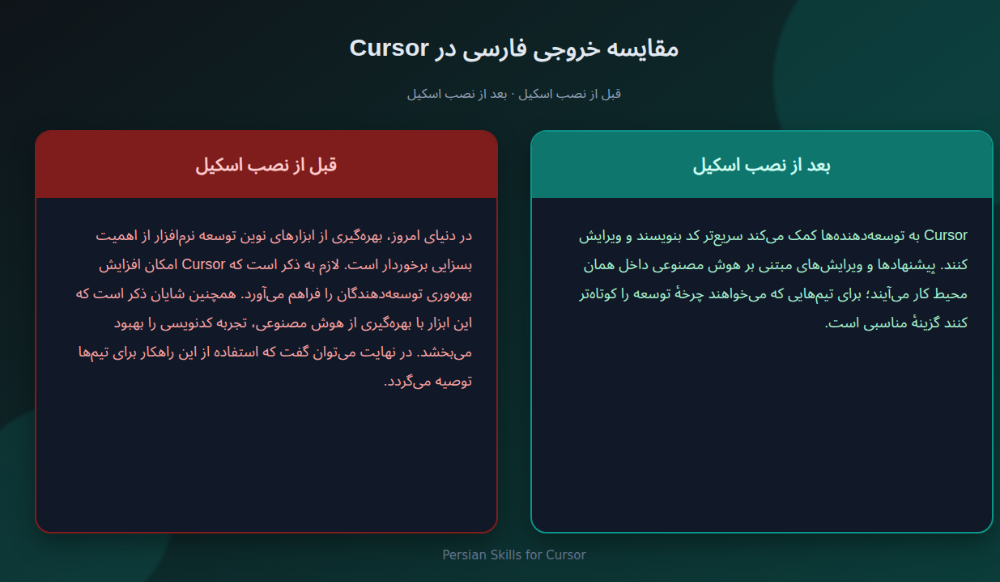

<div dir="rtl">

<p align="center">
  
</p>

<h1 align="center">اسکیل‌های فارسی حرفه‌ای برای Cursor</h1>

<p align="center">
  نویسنده‌ی فارسی داخل Cursor — نه ابزار طراحی سایت و نه جادوی کدنویسی
</p>

<p align="center">
  
  
  
</p>

<p align="center">
  
</p>

---

## این پروژه چیست؟

دو <span dir="ltr">Agent Skill</span> برای Cursor که وقتی Agent باید **متن فارسی** بنویسد یا ویرایش کند، خروجی را درست، روان و طبیعی نگه می‌دارند.

Cursor معمولاً فارسی را خشک، ترجمه‌ای و پر از کلیشه می‌نویسد. این اسکیل‌ها همان بخش را درست می‌کنند:

- نیم‌فاصله و نگارش فارسی
- لحن متناسب با مخاطب (فنی، محصول، ایمیل، UI و …)
- بدون کلیشه‌هایی مثل «در دنیای امروز…» و «لازم به ذکر است…»
- حفظ معنا؛ بدون اطلاعات جعلی
- حفظ نام ابزارها مثل Cursor، Docker، Python

| پوشه | نقش |
|------|-----|
| <span dir="ltr">[`persian-writing-mastery`](persian-writing-mastery/)</span> | نوشتن فارسی از صفر |
| <span dir="ltr">[`natural-persian-text-editor`](natural-persian-text-editor/)</span> | تحلیل و طبیعی‌سازی متن موجود (۵ حالت) |

## در وایب‌کدینگ به چه درد می‌خورد؟

در وایب‌کدینگ فقط کد نمی‌سازی؛ معمولاً همزمان باید فارسی هم بنویسی:

- README و توضیح پروژه
- متن دکمه‌ها و UI
- کپشن، معرفی محصول، پیام به مشتری
- مستند کوتاه یا آموزش داخل ریپو

این اسکیل‌ها **همان متن‌ها** را بهتر می‌کنند. قرار نیست طراحی سایت یا معماری کد را عوض کنند.

## این پروژه چه چیزی نیست؟

- پلاگین جادویی برای بهتر شدن طراحی UI نیست
- جایگزین پرامپت «یه سایت بساز» نیست
- ابزار دور زدن AI Detector نیست
- اگر دو متن فارسی را فقط به‌عنوان پرامپت طراحی بدهی، خروجی کد تقریباً یکی می‌ماند — چون اصلاً برای آن کار ساخته نشده

هدف: کیفیت واقعی نوشتار فارسی.

## نصب در یک پروژه

راهنمای کوتاه: <span dir="ltr">[INSTALL.md](INSTALL.md)</span>

۱. پوشه‌های <span dir="ltr">`persian-writing-mastery`</span> و <span dir="ltr">`natural-persian-text-editor`</span> را کپی کن به:

</div>

<div dir="ltr">

```text
your-project/.cursor/skills/
```

</div>

<div dir="rtl">

ساختار نهایی:

</div>

<div dir="ltr">

```text
your-project/
└── .cursor/
    └── skills/
        ├── persian-writing-mastery/
        │   └── SKILL.md
        └── natural-persian-text-editor/
            └── SKILL.md
```

</div>

<div dir="rtl">

۲. در چت Agent بگو مثلاً:

> اسکیل‌های فارسی داخل <span dir="ltr">`.cursor/skills`</span> را بخوان و از این به بعد برای متن فارسی از آن‌ها استفاده کن.

یا برای یک کار مشخص:

> با <span dir="ltr">`persian-writing-mastery`</span> یک README فارسی برای این پروژه بنویس.
> با <span dir="ltr">`natural-persian-text-editor`</span> این متن را طبیعی‌سازی کن.

## چه زمانی کدام اسکیل؟

- **تولید یا بازنویسی از صفر** ← <span dir="ltr">`persian-writing-mastery`</span>
- **تحلیل / ویرایش / طبیعی‌سازی متن موجود** ← <span dir="ltr">`natural-persian-text-editor`</span>

## تست سریع

نمونه‌ها در <span dir="ltr">[`tests/samples/`](tests/samples/)</span>:

</div>

<div dir="ltr">

```bash
python3 tests/validate_skills.py
```

</div>

<div dir="rtl">

## محدودیت‌ها

- منبع، نقل‌قول یا تجربهٔ شخصی جعلی نمی‌سازد.
- معنا را بدون دلیل تغییر نمی‌دهد و ادعای تأییدنشده اضافه نمی‌کند.
- غلط املایی یا شلختگی عمدی ایجاد نمی‌کند.
- عبور از آشکارساز متن هوش مصنوعی را تضمین نمی‌کند.

## سوالات متداول

### این اسکیل دقیقاً چه کار می‌کند؟

وقتی Cursor باید فارسی بنویسد، کمک می‌کند متن روان، درست و قابل‌استفاده باشد؛ نه ترجمه‌ی خشک و رسمیِ مصنوعی.

### فقط بازنویسی نیست؟ ارزش افزوده‌اش چیست؟

بازنویسی هدف نیست؛ **کیفیت نوشتار فارسی** هدف است. فرقی که در تصویر قبل/بعد می‌بینی، فرق ظاهر پرامپت طراحی نیست — فرق متنی است که واقعاً داخل پروژه / README / UI استفاده می‌کنی.

### توی وایب‌کدینگ کجا به کارم می‌آید؟

جایی که خروجیِ خودِ متن مهم است: README، توضیح فیچر، متن رابط، کپشن، پیام مشتری، مستند کوتاه. کنار کدنویسی، بخش فارسی پروژه را تمیز نگه می‌دارد.

### اگر همان دو متن را برای «طراحی سایت» به Agent بدهم، چرا خروجی یکی است؟

چون این اسکیل برای طراحی سایت ساخته نشده. پرامپت طراحی تقریباً همان کد را می‌سازد. ارزش اسکیل وقتی دیده می‌شود که از Agent بخواهی **خودِ متن فارسی** را بنویسد یا ویرایش کند.

### با پرامپت معمولی چه فرقی دارد؟

پرامپت یک‌بار مصرف است. اسکیل داخل پروژه می‌ماند و هر بار که Agent فارسی می‌نویسد، همان قواعد (نیم‌فاصله، لحن، ضدکلیشه، حفظ معنا) را تکرار می‌کند.

### آیا کد یا UI را بهتر می‌کند؟

نه. روی نوشتار فارسی تمرکز دارد، نه منطق برنامه یا ظاهر کامپوننت‌ها.

### چطور بفهمم کار می‌کند؟

یک پاراگراف README یا متن UI فارسی از Agent بدون اسکیل بگیر؛ بعد با اسکیل همان درخواست را تکرار کن. باید لحن طبیعی‌تر، نیم‌فاصله درست‌تر و کلیشه‌ی کمتر ببینی — مثل تصویر قبل/بعد بالای صفحه.

## لایسنس

این پروژه تحت لایسنس اختصاصی است. جزئیات: <span dir="ltr">[LICENSE](LICENSE)</span>

<p align="center">
  اگر برایت مفید بود، به دوستانت معرفی کن. لطفاً بازنشر یا کپی‌برداری از ریپو به‌نام خودت انجام نده.
</p>

</div>
